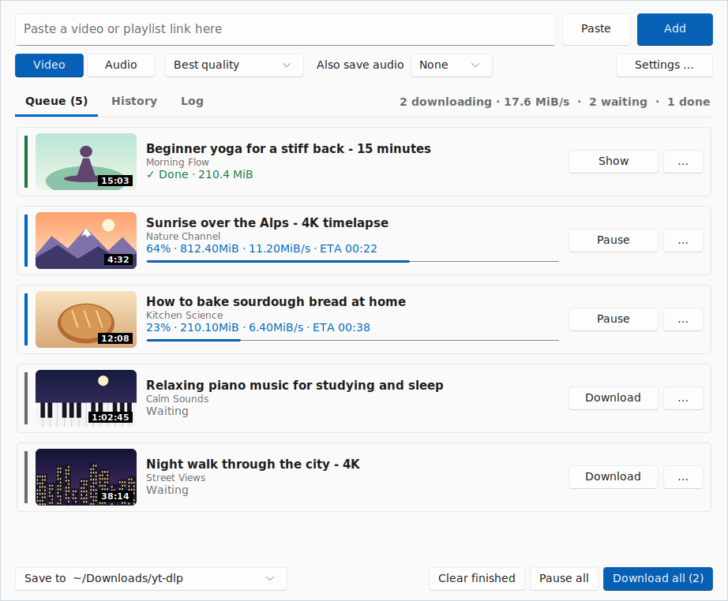
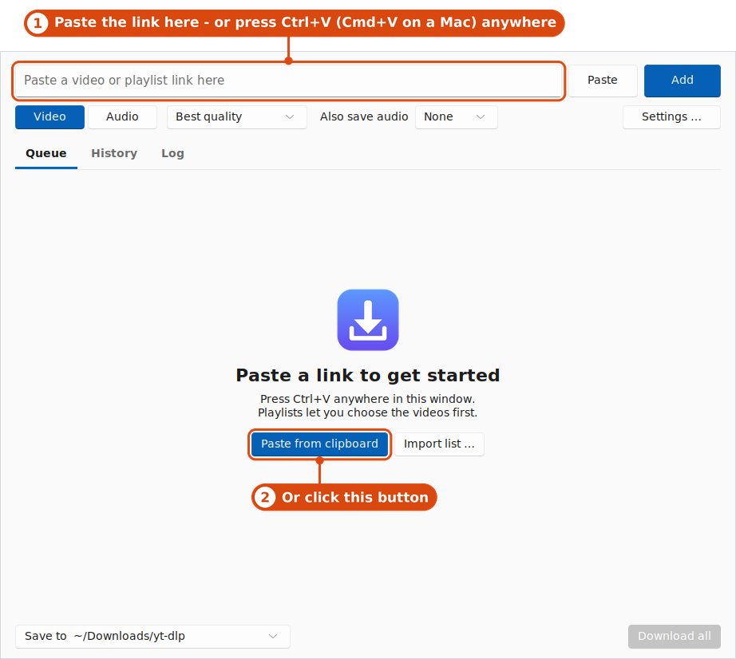
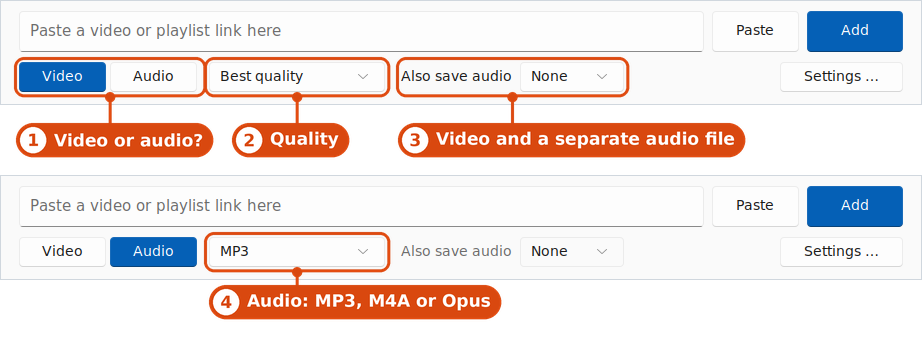
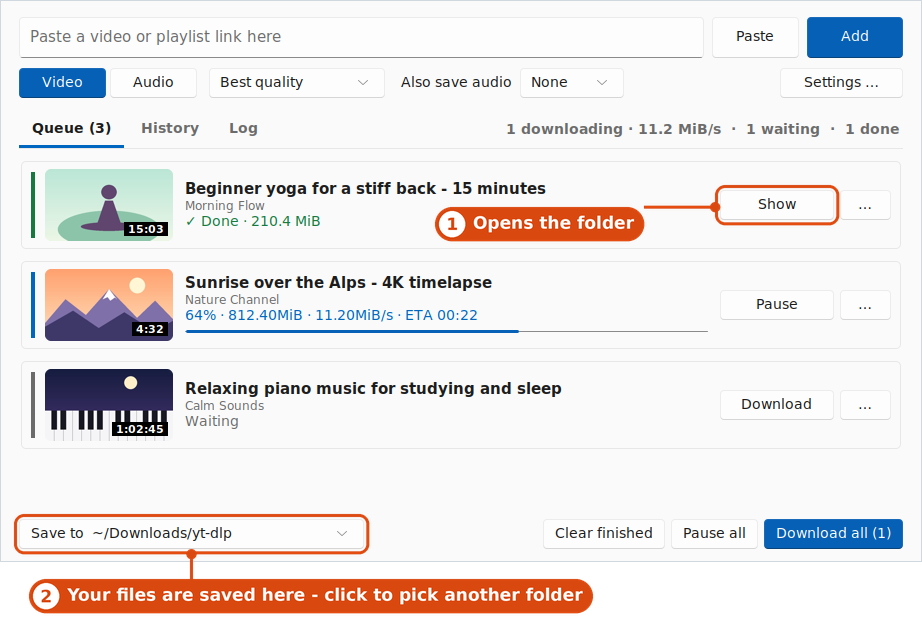
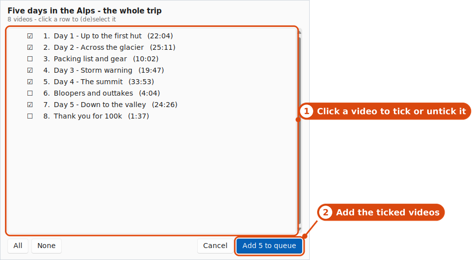
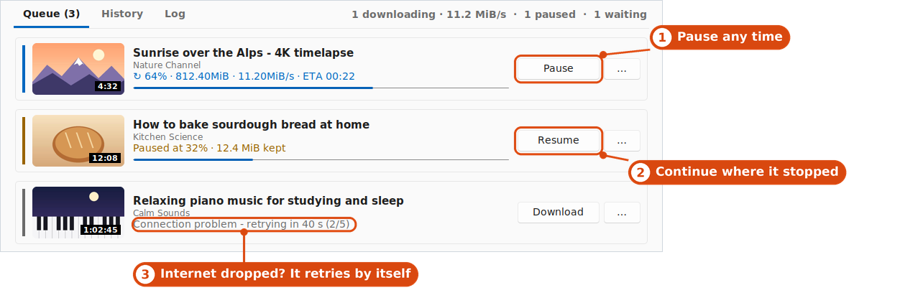
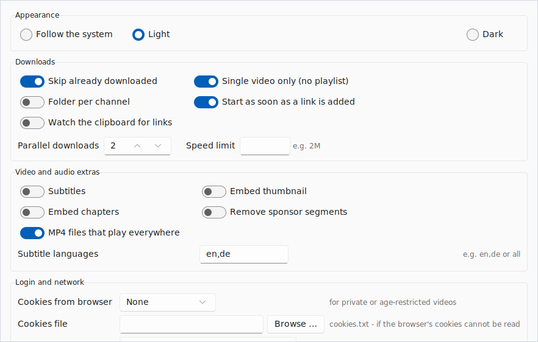

<h1 align="center">simple-ytdlp</h1>

  <b>Save videos and music from YouTube and many other websites - with a simple window.</b> 
  Free · no account · no ads · for Windows, macOS and Linux

  <picture>
    <source media="(prefers-color-scheme: dark)" srcset="docs/img/hero-dark.png">
    
  </picture>

  <a href="#download">Download</a> ·
  <a href="#how-it-works">How it works</a> ·
  <a href="#what-else-it-can-do">What else</a> ·
  <a href="#questions">Questions</a> ·
  <a href="#for-power-users">Power users</a> ·
  <a href="#for-developers">Developers</a>

## Download

Nothing to install - download, unzip, open.

| Your computer | Download |
|---|---|
| **Windows** | [simple-ytdlp-windows.zip](https://github.com/WhisperScript/simple-ytdlp/releases/latest/download/simple-ytdlp-windows.zip) |
| **Mac** with an Apple chip (M1, M2, M3, M4 …) | [simple-ytdlp-macos.zip](https://github.com/WhisperScript/simple-ytdlp/releases/latest/download/simple-ytdlp-macos.zip) |
| **Mac** with an Intel chip | [simple-ytdlp-macos-intel.zip](https://github.com/WhisperScript/simple-ytdlp/releases/latest/download/simple-ytdlp-macos-intel.zip) |
| **Linux** | [simple-ytdlp-linux.tar.gz](https://github.com/WhisperScript/simple-ytdlp/releases/latest/download/simple-ytdlp-linux.tar.gz) |

Not sure which Mac you have? Apple menu → **About This Mac**: "Chip: Apple M…" means Apple chip, "Processor: Intel …" means Intel.
All versions are on the [Releases page](https://github.com/WhisperScript/simple-ytdlp/releases).

**Opening it the first time** - the app is free and not signed with a paid developer certificate, so your
system warns once:

- **Windows:** double-click `simple-ytdlp.exe`. If "Windows protected your PC" appears, click **More info**, then **Run anyway**.
- **Mac:** unzip, drag `simple-ytdlp` into **Applications** and open it. If macOS says it cannot check the app, open
  **System Settings → Privacy & Security**, scroll down and click **Open Anyway**
  (older macOS: right-click the app → **Open**).
- **Linux:** `tar xzf simple-ytdlp-linux.tar.gz && ./simple-ytdlp`

On the very first start the app fetches the tools it needs (a few seconds, internet required). After that it just works.

## How it works

### 1. Copy a link and paste it

Copy the address of a video from your browser, then press **Ctrl+V** (Mac: **Cmd+V**) in the app - or click
**Paste from clipboard**. The video appears as a card with its picture and title, and the download starts.

  <picture>
    <source media="(prefers-color-scheme: dark)" srcset="docs/img/step1-paste-dark.png">
    
  </picture>

### 2. Video or audio?

Choose **Video** (pick the quality) or **Audio** to keep only the sound as MP3, M4A or Opus - handy for music and
podcasts. **Also save audio** gives you the video *and* a separate audio file in one go.

  <picture>
    <source media="(prefers-color-scheme: dark)" srcset="docs/img/step2-choose-dark.png">
    
  </picture>

### 3. Get your file

When a card says **✓ Done**, click **Show** to open the folder with your file. Files are saved in
`Downloads/yt-dlp` inside your user folder; the **Save to** button at the bottom changes that.
Finished downloads stay in the **History** tab, where you can open them again or download them once more.

  <picture>
    <source media="(prefers-color-scheme: dark)" srcset="docs/img/step3-files-dark.png">
    
  </picture>

The pictures were taken on Linux; fonts look slightly different on Windows and macOS.

## What else it can do

### Playlists - pick what you want

Paste a playlist link and a list opens first. Untick the videos you don't want, press **Add … to queue** - done.
(A link to a single video that happens to be part of a playlist only downloads that video. Turn off
"Single video only" in the settings if you want the whole playlist then.)

  <picture>
    <source media="(prefers-color-scheme: dark)" srcset="docs/img/playlist-dark.png">
    
  </picture>

### Pause and continue - nothing is lost

Press **Pause** and what has been downloaded stays on your disk; **Resume** carries on at exactly that spot, so
nothing is fetched twice. **Pause all** and **Resume all** do the same for the whole list.

- **Internet dropped?** The app waits a few seconds and continues by itself (up to five times), and tells you
  what it is doing. Problems a retry cannot fix - a private video, a removed video - are explained on the card.
- **Closed the app in the middle of a download?** The downloads are paused and continue the next time you start it.
- **Crash or power cut?** Same thing - and before continuing, the app re-checks the end of the half-finished
  file so the finished video is not damaged.

  <picture>
    <source media="(prefers-color-scheme: dark)" srcset="docs/img/pause-resume-dark.png">
    
  </picture>

### More

- **Many links at once:** paste as many as you like; they wait in line and download two at a time (up to four in the settings).
- **Same video twice?** A video is in the list once per format - paste it again and the app jumps to its card (a failed one is retried). Want it as MP3 or in another quality? That is a new download, saved under its own file name. Deleted the file? Paste the link again and it downloads again. ("Skip already downloaded" in the settings only skips videos that are in the History *and* still on your disk.)
- **Finished?** You get a notification when everything is done.
- **Light or dark:** follows your system; change it under **View → Theme**.
- **Everything in one place:** the **Settings …** button has subtitles, speed limit, file names, proxy and more.

  <picture>
    <source media="(prefers-color-scheme: dark)" srcset="docs/img/settings-dark.png">
    
  </picture>

## Questions

<b>Is it safe? Why does my computer warn me?</b>

Windows and macOS warn about every app that is not signed with a paid developer certificate - that is all
the warning means. The source code is open for everyone to read right here. The app only talks to the website
of the video you give it and to GitHub (to fetch its helper tools and to look for updates).

<b>Where are my files? Can I change the folder?</b>

In `Downloads/yt-dlp` inside your user folder. Click **Save to …** at the bottom left: **Change folder …**
picks another one, **Open folder** shows it.

<b>A video says "Age-restricted", "Private video" or "YouTube wants a login"</b>

Some videos are only shown to logged-in users. Open **Settings …**, choose the browser you are logged in with under
**Cookies from browser**, then press **Retry** on the card. The app only reads the login from your browser to
ask the website for the video.

<b>A card says "ffprobe is missing"</b>

Some downloads (for example videos that come in separate picture and sound streams) need a second helper tool,
ffprobe. Use **Tools → Get ffmpeg tools** (about 150 MB, once; Windows and Linux), then press **Retry**. On a Mac:
`brew install ffmpeg`.

<b>Suddenly every download fails</b>

The website probably changed something. Use **Tools → Update yt-dlp**, then **Retry**. The app also checks for
an update by itself once a day.

<b>Which websites work?</b>

YouTube and a lot of others - everything the open-source tool [yt-dlp](https://github.com/yt-dlp/yt-dlp) knows, see
its [list of supported sites](https://github.com/yt-dlp/yt-dlp/blob/master/supportedsites.md). If a site
is not on the list, the card tells you the link is not supported.

<b>How do I update the app?</b>

A banner appears when a new version is out: click **Update now**. The app downloads it, replaces itself and restarts;
your settings stay. On a Mac, keep the app in **Applications** (not in Downloads) so it can replace itself.
Or simply download the new version from the [Releases page](https://github.com/WhisperScript/simple-ytdlp/releases/latest).

<b>I used the old "ytdl" - is this the same app?</b>

Yes, it was renamed. Settings, history and tools are moved over on the first start. Versions up to 2.0 cannot update
themselves to the new name - download the new version once from Releases, then the built-in update works again.

<b>How do I uninstall it?</b>

Delete the app. To remove its settings and helper tools as well, delete the data folder:
Windows `%LOCALAPPDATA%\simple-ytdlp`, macOS `~/Library/Application Support/simple-ytdlp`,
Linux `~/.local/share/simple-ytdlp`. Your downloaded videos are not touched.

<b>Is this legal?</b>

simple-ytdlp is a tool, like a web browser - you are responsible for what you save. Respect copyright and the
terms of the websites; download what you have the right to keep.

---

## For power users

### In the window

- **Per download:** right-click a card (or double-click it, or press Enter; finished ones open their file
  instead) to change just that download: video/audio quality, an exact format picked from the real format
  list (video + audio rows are combined), only a part of the video (start/end, optionally an exact re-encoded
  cut), chapters (embed markers, one file per chapter) and extra yt-dlp arguments. "Apply to all waiting"
  copies the choices to the rest of the queue. The menu also copies the link, opens it in the browser and
  shows finished files.
- **Settings (whole queue):** the *Settings …* button (Cmd/Ctrl+comma) opens a window sorted by topic: subtitles with
  your own languages, embedded thumbnail, skip already downloaded, folder per channel, file name template,
  SponsorBlock, chapters, speed limit, proxy, cookies from a browser, extra yt-dlp arguments, parallel downloads,
  start automatically (on by default).
- **Profiles:** save the current settings under a name ("Music", "Archive", …) and load them with one click.
- **Clipboard watcher:** optionally adds every link you copy, in any program.
- **Select and act on many:** click, Shift-click (range) and Ctrl/Cmd-click (add) select cards; the right-click
  menu and the keys below work on the whole selection. The list only builds the rows you can see, so a
  playlist with thousands of videos scrolls as smoothly as three links.
- **Resume in detail:** *Pause* keeps the `.part` file and *Resume* continues with an HTTP range request - the same idea
  as `rsync --partial`. Automatic retries wait 3, 10, 30, 60 and 120 seconds ("Download all" skips the
  wait). After a crash the last MiB of a partial file is fetched again (fragment downloads such as HLS/DASH
  track their state themselves and are left alone). *Start over* deletes the partial data. Servers that do not
  support range requests cannot continue - yt-dlp then starts over by itself.
- **The queue survives a restart:** waiting, paused and failed items are restored, with their options and partial data.
- **Clear error messages** on the card; the log (with filter and copy button) keeps the raw output.
- **Menu bar:** native on every system (top of the screen on macOS), with keyboard shortcuts.

On macOS use Cmd instead of Ctrl and Option instead of Alt.

| Key | Action |
|---|---|
| Ctrl+V | paste links |
| Ctrl+Enter | download / resume all |
| Ctrl+. | pause all |
| ↑ ↓ Home End, Shift+↑ ↓ | move / extend the selection |
| Space | pause or resume the selected downloads |
| Enter | options of the selected download |
| Delete | remove the selected downloads |
| Ctrl+A | select all |
| Alt+↑ / Alt+↓ | move the selected downloads in the queue |
| Ctrl+1 / 2 / 3 | Queue / History / Log |
| Ctrl+, | settings |

### Updates in detail

- **yt-dlp** updates itself (daily check at startup, or **Tools → Update yt-dlp**).
- **The app itself** shows a banner ("A new version of simple-ytdlp is available") when a newer release exists
  on GitHub. **"Update now"** downloads it (checksum-verified), replaces the running program and restarts it; your
  settings are kept. "Release page" opens the download page instead. The check is silent if you are offline.
  - Windows/Linux: the program file is replaced in place. It must be in a folder you can write to (Downloads,
    Desktop, … but not `C:\Program Files`).
  - macOS: `simple-ytdlp.app` is replaced; move it out of the Downloads folder first (e.g. to Applications),
    otherwise macOS runs it from a read-only location and the automatic update falls back to the manual download.
  - If anything goes wrong the old version stays in place and you get the release page link.
- If macOS still refuses to open the app: `xattr -dr com.apple.quarantine simple-ytdlp.app`

### Command line

The same program, without the window when you give it links:

    uv run simple-ytdlp.py "https://youtube.com/watch?v=XXXX"
    uv run simple-ytdlp.py -a urls.txt -m mp3 -o ~/Music --archive
    uv run simple-ytdlp.py URL --mode video1080 --subs --thumb --by-uploader

Modes: `video` (best quality), `video2160`, `video1440`, `video1080`, `video720`, `video480`, `mp3`, `m4a`, `opus`.

Video **and** audio in one go: with a video mode, `--also-audio mp3` (or `m4a` / `opus`) keeps the video and
additionally saves a separate audio file with the same name (in the window: "Also save audio").

    uv run simple-ytdlp.py URL -m video1080 --also-audio mp3

Unknown flags are passed on to yt-dlp unchanged:

    uv run simple-ytdlp.py URL --playlist-items 1-5
    uv run simple-ytdlp.py URL --simulate          # only check, download nothing

The default output folder is `~/Downloads/yt-dlp`. Failed URLs end up there in `failed.log`; with `--archive`,
`archive.txt` remembers videos that were already downloaded, so running the same list again only fetches what is
new (handy for cron). For private or age-restricted videos use `--cookies-from-browser chrome`, or the browser
dropdown in the settings. Without links, or with `--gui`, the window opens.

### Run it from the script

A single file. With [uv](https://docs.astral.sh/uv/) the machine needs **nothing** except uv itself - Python, the
packages and ffmpeg are fetched on first start and kept in a cache. yt-dlp and deno are downloaded into the user
data folder.

1. Install uv - macOS / Linux: `curl -LsSf https://astral.sh/uv/install.sh | sh`,
   Windows (PowerShell): `powershell -c "irm https://astral.sh/uv/install.ps1 | iex"`. Then open a new terminal.
2. Copy `simple-ytdlp.py` over and start it: `uv run simple-ytdlp.py`
   (on macOS/Linux after `chmod +x simple-ytdlp.py` also `./simple-ytdlp.py` - the shebang line calls uv).

Without uv, an existing Python works too: `pip install imageio-ffmpeg certifi sv-ttk darkdetect pillow`, then
`python3 simple-ytdlp.py`. On Linux you may need `sudo apt install python3-tk` for the window.

### What happens automatically

- **ffmpeg:** a system ffmpeg is preferred; if there is none, a bundled binary (`imageio-ffmpeg`) is used. It lacks
  ffprobe - standard cases such as mp3 extraction and video merging work fine (tested).
- **JS engine:** YouTube needs one, otherwise high-resolution formats are missing. The program downloads deno on
  first start; an existing deno/node/bun is used otherwise.
- **Playlists:** in the window "Single video only" is on by default, so a video URL with `&list=…` does not pull in
  the whole playlist.
- **Windows:** no flashing console windows from subprocesses.
- Settings and the downloaded tools live in the user data folder (Windows `%LOCALAPPDATA%\simple-ytdlp`,
  macOS `~/Library/Application Support/simple-ytdlp`, Linux `~/.local/share/simple-ytdlp`).

## For developers

### Tests

    python -m pip install pyflakes
    python -m pyflakes simple-ytdlp.py tests docs
    python -m unittest discover -s tests -v

- `tests/test_core.py` - the parts without a window (argument building, parsers, resume helpers, queue storage, ...).
- `tests/test_gui.py` - the real window, driven with a fake yt-dlp (`tests/fake_ytdlp.py`): the virtual list,
  selection and keys, menus, pause/resume, automatic retries, options, persistence.
- `tests/test_resume_e2e.py` - the real yt-dlp against a local HTTP server that supports Range requests, throttles
  and drops connections; every finished file must be bit-identical to the source.
- `tests/test_real_ytdlp.py` - real yt-dlp and ffmpeg: video + audio in one go, exact cuts.

The window tests need Tk, sv-ttk, Pillow and a display (`pip install sv-ttk pillow yt-dlp imageio-ffmpeg`; on Linux
`sudo apt install python3-tk xvfb` and `xvfb-run -a python -m unittest discover -s tests -v`) and skip themselves
otherwise. They use a temporary data folder, never your real settings. They run on every pull request
(`.github/workflows/ci.yml`: `test` on Python 3.9 and 3.12, `gui` under a virtual display).

### Screenshots

The pictures in this README are generated by `docs/make_screenshots.py` (made-up downloads, light and dark,
with call-outs) - run it again after changing the look:

    xvfb-run -a -s "-screen 0 1800x1100x24" python docs/make_screenshots.py

### Building the programs

The workflow [.github/workflows/build.yml](.github/workflows/build.yml) builds Windows, macOS (Apple chip and
Intel) and Linux. Started by hand (**Actions → Build → Run workflow**) without a tag it only produces downloadable
artifacts. Locally, e.g. on Windows:

    pip install pyinstaller imageio-ffmpeg certifi sv-ttk darkdetect pillow
    python simple-ytdlp.py --make-icons build-assets
    pyinstaller --onefile --windowed --name simple-ytdlp --icon build-assets/icon.ico --collect-all imageio_ffmpeg --collect-all sv_ttk simple-ytdlp.py

(The icon is drawn by the program itself. On macOS leave out `--onefile` and use `icon.icns`; on Linux no icon is
embedded.)

### Publishing a release

**Actions → Build → Run workflow**, enter the tag (e.g. `v2.3`) and optional release notes. The workflow writes
the tag into the app as its version number (`v2.3` → `2.3`), builds everything, creates the tag on the selected
branch and publishes the release. Or push a tag: `git tag v2.3 && git push origin v2.3`.

Use a higher number every time (`v2.3`, `v2.4`, `v2.10`, …) - that is how running apps recognize that something
newer exists.
